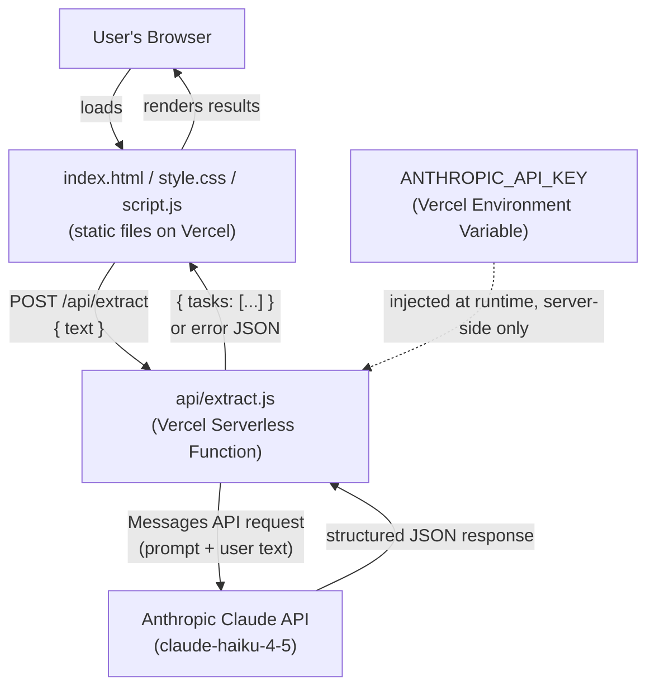
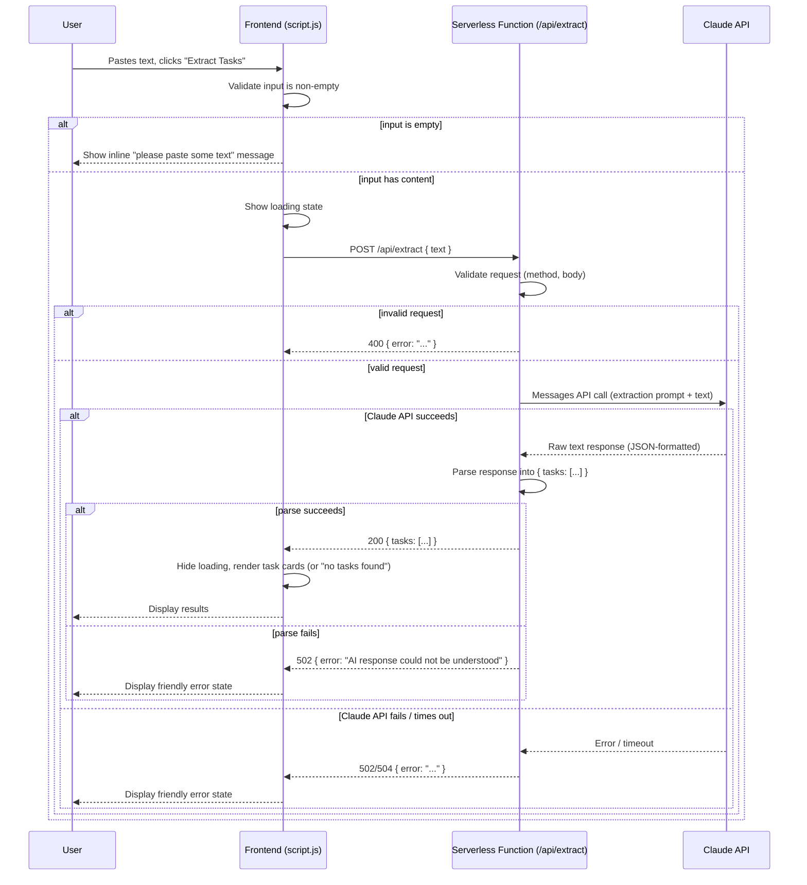

# TaskSpark — Architecture

**Day 2 deliverable | Source of truth for system design, alongside the PRD and Implementation Blueprint.**

---

## 1. Finalized Tech Stack

| Layer | Choice | Why this is the best fit |
|---|---|---|
| **Frontend** | Plain HTML + CSS + vanilla JavaScript (single page) | No accounts, no routing, no client-side state to manage beyond one screen — a framework (React/Vue) would add build tooling and complexity with zero benefit here. Loads instantly, is trivial to style well in short sessions, and has zero dependency risk before a demo. |
| **Backend** | One Node.js serverless function (`api/extract.js`) on Vercel | The only backend job is: receive text, call Claude, return JSON. A single function does this with no server to provision, patch, or pay for. Free-tier Vercel Functions cold-start in ~1–2s, well within the PRD's ~5s response target. |
| **Database** | **None** | v1.0 is explicitly stateless (PRD Section 5 — no accounts, no history). Every user story is satisfied without persistence (see `SCHEMA.md`). Adding a database would be pure scope creep against the approved PRD. |
| **Authentication** | **None** | No accounts or personalized data exist in v1.0. Anything worth protecting (the Anthropic API key) is protected at the infrastructure level (server-side env variable), not via user auth. |
| **AI Model / API** | Anthropic Claude API via `@anthropic-ai/sdk`, called only from `api/extract.js` | Already decided Day 1; API key already available. Recommended model: **`claude-haiku-4-5-20251001`** — fast and cost-efficient, well-suited to a short, structured extraction task with a tight latency budget. If extraction accuracy on tricky test cases (Day 6) isn't good enough, `claude-sonnet-5` is the fallback for higher reasoning quality at slightly higher latency/cost. |
| **Hosting** | Vercel (Free Tier) | Deploys static files + serverless functions from the same repo with zero configuration; integrates directly with GitHub (push to deploy); matches the builder's existing GitHub/deployment familiarity. |
| **Other tools/libraries** | `dotenv` (local env loading), Vercel CLI (`vercel dev` for local testing) | Both free, both minimal — no other dependencies needed for v1.0. |

This table finalizes (does not change) the stack proposed in the Day 1 blueprint — the only new, concrete decision made today is the specific Claude model string.

---

## 2. Component Diagram

**Key architectural principle:** the Anthropic API key never reaches the browser. All AI calls are proxied through the serverless function, which is the only place the key exists (as a server-side environment variable).

---

## 3. Data Flow (Request Lifecycle)

This diagram is the authoritative reference for building error handling on Day 4 (backend) and Day 5 (integration) — every branch shown here needs a corresponding code path.

---

## 4. AI Interaction Design

- **Single call per extraction** — no multi-turn conversation, no chained calls. Keeps latency and cost predictable.
- **Structured output via prompting** — the system/user prompt instructs Claude to return *only* valid JSON in a fixed shape (`{ "tasks": [ { "task": "...", "dueDate": "..." | null } ] }`), with few-shot examples drawn directly from the PRD's sample test cases (Section 9).
- **No AI-side state** — Claude is stateless between requests; all context (the user's pasted text) is included fresh in every call.
- **Defensive parsing** — the serverless function treats the AI response as untrusted text: it attempts `JSON.parse()` in a `try/catch` and never assumes well-formed output. This is a hardening detail owned by Day 4/6 of the Implementation Blueprint.

---

## 5. External Services

| Service | Role | Cost | Failure handling |
|---|---|---|---|
| Anthropic Claude API | Task extraction + due date detection | Existing API key (pay-as-you-go, low volume expected for a demo tool) | Wrapped in try/catch; timeout + error responses surfaced as a friendly UI error state, never a crash |
| Vercel | Static hosting + serverless function hosting + environment variable storage | Free tier | Vercel's own uptime; no custom fallback needed for a capstone-scale demo |
| GitHub | Source control, triggers Vercel deployments on push | Free | N/A |

No other external services (no database provider, no auth provider, no analytics, no third-party task-tool integrations) — consistent with the PRD's "Out of Scope" list.

---

## 6. Why No Additional Architecture Is Needed

Given the locked v1.0 scope (PRD Section 5), this two-hop architecture (browser → serverless function → Claude API) is deliberately the simplest architecture that satisfies every functional requirement (FR-1 through FR-10). Anything more — a database, a queue, authentication, multiple services — would be solving problems the PRD explicitly does not have in v1.0.
