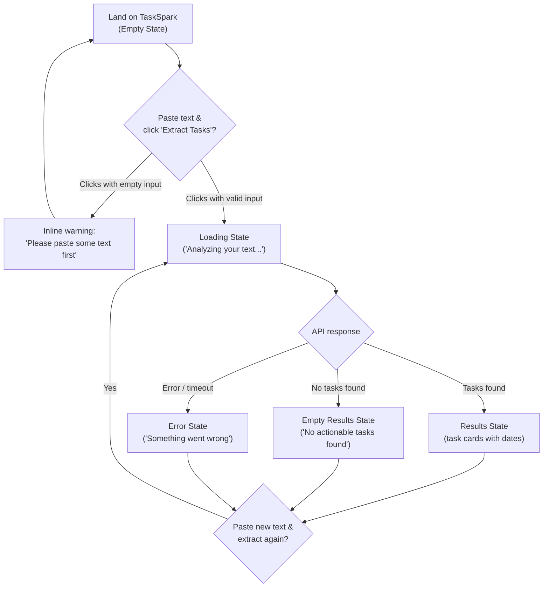
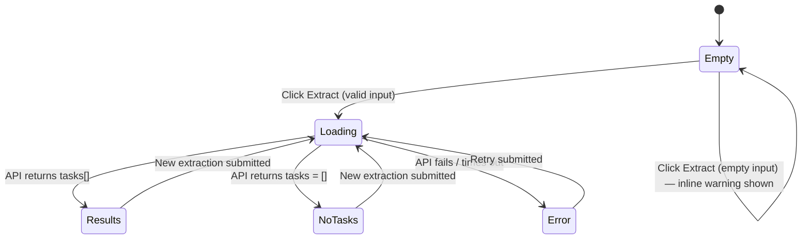

# TaskSpark — UI & User Flow

**Day 2 deliverable.** TaskSpark is a single-page app — there is no multi-screen navigation. Every "screen" below is a *state* of the same page, not a separate route.

---

## 1. User Flow Diagram



**Every screen exists for a reason:**
- **Empty State** — first impression; must explain the product in one glance (US-3).
- **Loading State** — reassures the user something is happening during the ~2–5s Claude call.
- **Results State** — the core value delivery (US-1, US-2, US-4).
- **Empty Results State** — prevents confusion when text has no real tasks (US-5).
- **Error State** — keeps the app trustworthy and demo-safe even when something fails.

No screen is decorative; each maps directly to a PRD functional requirement or user story.

---

## 2. Screen Flow (State Machine)



There are exactly **5 states**, all living inside one HTML page. This matches the "no navigation" decision from the PRD (single input box, single button, single results area).

---

## 3. Navigation

**There is none** — and that's intentional. A single page with zero navigation:
- Removes an entire category of bugs (broken links, routing state)
- Matches the "zero setup, instant use" pitch (Pitch Deck, Slide 5, Feature #5)
- Keeps the judge's demo experience to one screen, one action, one result

The only "navigation" a user performs is scrolling (if content is long) and re-using the same input/button to run another extraction.

---

## 4. Low-Fidelity Wireframes

### 4.1 Empty State (initial load)
```
┌──────────────────────────────────────────────────┐
│  TaskSpark                                        │
│  Messy text in. Clear tasks out.                   │
│                                                    │
│  ┌──────────────────────────────────────────────┐ │
│  │ Paste your messy notes, email, or chat here...│ │
│  │                                                │ │
│  │                                                │ │
│  │                                                │ │
│  └──────────────────────────────────────────────┘ │
│                                                    │
│              [  Extract Tasks  ]                   │
│                                                    │
│  ┌──────────────────────────────────────────────┐ │
│  │  Paste a messy note, email, or chat above —    │ │
│  │  TaskSpark will pull out the tasks and         │ │
│  │  deadlines for you.                            │ │
│  └──────────────────────────────────────────────┘ │
└──────────────────────────────────────────────────┘
```

### 4.2 Loading State
```
┌──────────────────────────────────────────────────┐
│  TaskSpark                                        │
│                                                    │
│  ┌──────────────────────────────────────────────┐ │
│  │ [ ...user's pasted text, textarea disabled... ]│ │
│  └──────────────────────────────────────────────┘ │
│                                                    │
│         [ ⟳  Analyzing your text... ]  (disabled) │
│                                                    │
│                    ⟳                               │
│           (spinner, centered)                      │
└──────────────────────────────────────────────────┘
```

### 4.3 Results State (tasks found)
```
┌──────────────────────────────────────────────────┐
│  TaskSpark                                        │
│                                                    │
│  ┌──────────────────────────────────────────────┐ │
│  │ [ ...user's pasted text still visible... ]    │ │
│  └──────────────────────────────────────────────┘ │
│                                                    │
│              [  Extract Tasks  ]                   │
│                                                    │
│  ┌──────────────────────────────────────────────┐ │
│  │ ✔ Send the deck              [ Due: Friday ]   │ │
│  ├──────────────────────────────────────────────┤ │
│  │ ✔ Get budget numbers from Raj [Due: Monday]    │ │
│  └──────────────────────────────────────────────┘ │
└──────────────────────────────────────────────────┘
```

### 4.4 Empty Results State (no tasks found)
```
┌──────────────────────────────────────────────────┐
│  TaskSpark                                        │
│                                                    │
│  ┌──────────────────────────────────────────────┐ │
│  │ [ ...user's pasted text... ]                   │ │
│  └──────────────────────────────────────────────┘ │
│                                                    │
│              [  Extract Tasks  ]                   │
│                                                    │
│  ┌──────────────────────────────────────────────┐ │
│  │  No action items found in this text — try      │ │
│  │  pasting something with a task or deadline     │ │
│  │  in it.                                        │ │
│  └──────────────────────────────────────────────┘ │
└──────────────────────────────────────────────────┘
```

### 4.5 Error State
```
┌──────────────────────────────────────────────────┐
│  TaskSpark                                        │
│                                                    │
│  ┌──────────────────────────────────────────────┐ │
│  │ [ ...user's pasted text... ]                   │ │
│  └──────────────────────────────────────────────┘ │
│                                                    │
│              [  Extract Tasks  ]                   │
│                                                    │
│  ┌──────────────────────────────────────────────┐ │
│  │  ⚠ Something went wrong extracting your        │ │
│  │  tasks. Please try again.                      │ │
│  └──────────────────────────────────────────────┘ │
└──────────────────────────────────────────────────┘
```

---

## 5. Mapping to Implementation Days

| Wireframe / state | Built on | Polished on |
|---|---|---|
| Empty State (layout + copy) | Day 3 | Day 7 |
| Loading State | Day 3 (visual) / Day 5 (wired to real fetch) | Day 7 (spinner/animation) |
| Results State | Day 3 (fake data) / Day 5 (real data) | Day 7 (transitions) |
| Empty Results State | Day 5 | Day 7 |
| Error State | Day 5 | Day 7 |

This table keeps Day 3 and Day 5 focused exactly on what's already scoped in the Implementation Blueprint — no new work has been added today, only clarified.
